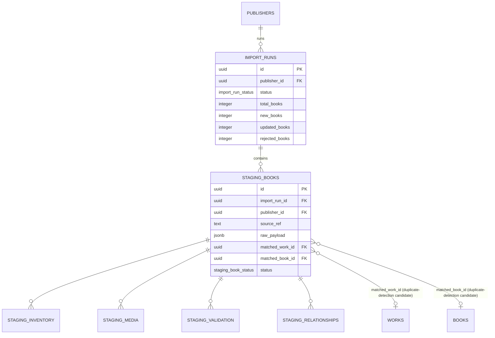

# ERD

Full column lists are in `plan/database/ddl/catalog.sql` and
`staging.sql` — this is the relationship map, not a substitute.

## Catalog schema

```mermaid
erDiagram
    WORKS ||--o{ BOOKS : "has editions/translations"
    WORKS }o--o{ AUTHORS : "written by (work_authors)"
    WORKS }o--o{ THEMES : "tagged (work_themes)"
    WORKS }o--o{ GENRES : "tagged (work_genres)"
    WORKS }o--o{ LITERARY_MOVEMENTS : "part of"
    BOOKS }o--o{ AUTHORS : "contributors (book_contributors: translator/illustrator/editor)"
    BOOKS }o--o{ COLLECTIONS : "shelved in (book_collections)"
    BOOKS ||--|| INVENTORY : "has (1:1, deliberately separate table)"
    BOOKS |o--o| BOOKS : "translated_from_book_id (self, nullable)"
    BOOKS }o--|| PUBLISHERS : "published by"
    BOOKS }o--o| MEDIA_ASSETS : cover
    AUTHORS ||--o{ AUTHOR_ALIASES : "known as"
    PUBLISHERS }o--o| MEDIA_ASSETS : logo

    WORKS {
        uuid id PK
        text canonical_title
        char original_language
        enum work_type
        editorial_status status
    }
    BOOKS {
        uuid id PK
        uuid work_id FK
        uuid publisher_id FK
        char isbn13 UK
        text title
        char language
        editorial_status status
    }
    INVENTORY {
        uuid book_id PK_FK
        integer stock
        numeric price
        char currency
        enum availability
    }
    PUBLISHERS {
        uuid id PK
        text code UK
        enum adapter_type
        text last_import_cursor
    }
```

Status invariant not shown by the diagram itself: a `BOOKS.status` of
`published` is blocked by a DB trigger unless its `WORKS.status` is
`approved`/`published` — see `state-machines/book.md` and
`catalog.enforce_book_work_status()`.

## Staging schema (crosses into catalog for match references only)



Note the arrows point from `staging` into `catalog`/`works`/`books` —
never the reverse. Nothing in `catalog` or `staging`'s own schema
references anything in `commerce`; Commerce references `catalog.books.id`
by opaque ID only, with no FK constraint across the schema boundary
(cross-schema FKs are deliberately avoided so Commerce and Catalog can
evolve, and in principle be split into separate databases later, without
a hard coupling — see SPEC-06).
